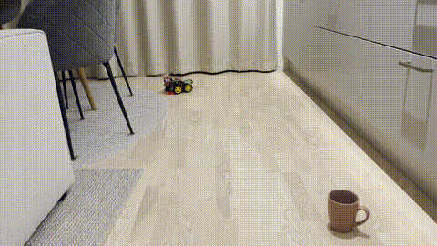

## Arduino Robo Car
 

  

---
 
A small Arduino-based robot car project built to explore basic robotics, motor control, sensors, and embedded programming.

## Overview

This project uses an Arduino to control a simple robotic car. The goal is to understand how hardware components such as motors, sensors, and motor drivers can work together to create an autonomous or manually controlled vehicle.

This robot car is designed to run on a gradient track with curves which the IR sensors read and control the direction and speed of the mortors to change its direction. 
It also uses Ultrasonic sensor to measure distance and if the distance of object is too close, it would stop or change directions.

 

  

## Using UltraSonic Sensor to find direction of closest object.

 

  

## Using UltraSonic Sensor to find direction of closest object.

The project is mainly created as a learning project for:
- Arduino programming
- embedded systems
- robotics
- motor control
- sensor-based movement

## Features

- Arduino-controlled robot car
- DC motor control
- Basic movement: forward, backward, left, and right
- Sensor-based behavior
- Ultrasonic sensor readings
- Infrared sensor readings

## Technologies

- Arduino
- C/C++
- Motor driver module
- DC motors
- Ultrasonic and Infrared Sensors

## Project Goal

The purpose of this project is to run the car on a gradient track with curves which the IR sensors read and control the direction and speed of the mortors, this is so we can learn how to dynamically control the motors and actuators using sensor data input.

The project is experimental and can be extended with features such as obstacle avoidance, Bluetooth control, line following, or autonomous navigation.
 
